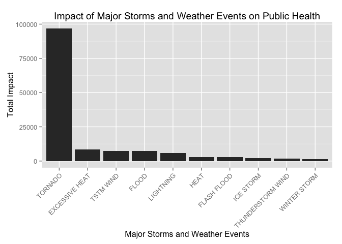

# Explore the NOAA Storm Database: finding characteristics of major storms and weather events in the U.S.
Yingjie Cao  
23 Feb 2016  

#Synopsis

In this report, we aim to analyze the impact of different weather events on public health and economy based on the storm database collected from the U.S. National Oceanic and Atmospheric Administration's (NOAA) from 1950 - 2011. We will use the estimates of fatalities, injuries, property damage and crop damage to decide which types of event are most harmful to the population health and economy. From these data, we found that tornado are most harmful with respect to both population health and economic consequences. Besides, excessive heat, tstm wind, flood, hail can also have large impacts.

#Data Processing

First you should download the Storm Data and make sure it is in your currect working repository.


```r
# basic setting
library(dplyr)
```

```
## 
## Attaching package: 'dplyr'
```

```
## The following objects are masked from 'package:stats':
## 
##     filter, lag
```

```
## The following objects are masked from 'package:base':
## 
##     intersect, setdiff, setequal, union
```

```r
library(ggplot2)
# load data
StormData<-read.csv(bzfile("repdata-data-StormData.csv.bz2"))
dim(StormData)
```

```
## [1] 902297     37
```

```r
str(StormData)
```

```
## 'data.frame':	902297 obs. of  37 variables:
##  $ STATE__   : num  1 1 1 1 1 1 1 1 1 1 ...
##  $ BGN_DATE  : Factor w/ 16335 levels "1/1/1966 0:00:00",..: 6523 6523 4242 11116 2224 2224 2260 383 3980 3980 ...
##  $ BGN_TIME  : Factor w/ 3608 levels "00:00:00 AM",..: 272 287 2705 1683 2584 3186 242 1683 3186 3186 ...
##  $ TIME_ZONE : Factor w/ 22 levels "ADT","AKS","AST",..: 7 7 7 7 7 7 7 7 7 7 ...
##  $ COUNTY    : num  97 3 57 89 43 77 9 123 125 57 ...
##  $ COUNTYNAME: Factor w/ 29601 levels "","5NM E OF MACKINAC BRIDGE TO PRESQUE ISLE LT MI",..: 13513 1873 4598 10592 4372 10094 1973 23873 24418 4598 ...
##  $ STATE     : Factor w/ 72 levels "AK","AL","AM",..: 2 2 2 2 2 2 2 2 2 2 ...
##  $ EVTYPE    : Factor w/ 985 levels "   HIGH SURF ADVISORY",..: 834 834 834 834 834 834 834 834 834 834 ...
##  $ BGN_RANGE : num  0 0 0 0 0 0 0 0 0 0 ...
##  $ BGN_AZI   : Factor w/ 35 levels "","  N"," NW",..: 1 1 1 1 1 1 1 1 1 1 ...
##  $ BGN_LOCATI: Factor w/ 54429 levels ""," Christiansburg",..: 1 1 1 1 1 1 1 1 1 1 ...
##  $ END_DATE  : Factor w/ 6663 levels "","1/1/1993 0:00:00",..: 1 1 1 1 1 1 1 1 1 1 ...
##  $ END_TIME  : Factor w/ 3647 levels ""," 0900CST",..: 1 1 1 1 1 1 1 1 1 1 ...
##  $ COUNTY_END: num  0 0 0 0 0 0 0 0 0 0 ...
##  $ COUNTYENDN: logi  NA NA NA NA NA NA ...
##  $ END_RANGE : num  0 0 0 0 0 0 0 0 0 0 ...
##  $ END_AZI   : Factor w/ 24 levels "","E","ENE","ESE",..: 1 1 1 1 1 1 1 1 1 1 ...
##  $ END_LOCATI: Factor w/ 34506 levels ""," CANTON"," TULIA",..: 1 1 1 1 1 1 1 1 1 1 ...
##  $ LENGTH    : num  14 2 0.1 0 0 1.5 1.5 0 3.3 2.3 ...
##  $ WIDTH     : num  100 150 123 100 150 177 33 33 100 100 ...
##  $ F         : int  3 2 2 2 2 2 2 1 3 3 ...
##  $ MAG       : num  0 0 0 0 0 0 0 0 0 0 ...
##  $ FATALITIES: num  0 0 0 0 0 0 0 0 1 0 ...
##  $ INJURIES  : num  15 0 2 2 2 6 1 0 14 0 ...
##  $ PROPDMG   : num  25 2.5 25 2.5 2.5 2.5 2.5 2.5 25 25 ...
##  $ PROPDMGEXP: Factor w/ 19 levels "","-","?","+",..: 17 17 17 17 17 17 17 17 17 17 ...
##  $ CROPDMG   : num  0 0 0 0 0 0 0 0 0 0 ...
##  $ CROPDMGEXP: Factor w/ 9 levels "","?","0","2",..: 1 1 1 1 1 1 1 1 1 1 ...
##  $ WFO       : Factor w/ 542 levels ""," CI","%SD",..: 1 1 1 1 1 1 1 1 1 1 ...
##  $ STATEOFFIC: Factor w/ 250 levels "","ALABAMA, Central",..: 1 1 1 1 1 1 1 1 1 1 ...
##  $ ZONENAMES : Factor w/ 25112 levels "","                                                                                                                               "| __truncated__,..: 1 1 1 1 1 1 1 1 1 1 ...
##  $ LATITUDE  : num  3040 3042 3340 3458 3412 ...
##  $ LONGITUDE : num  8812 8755 8742 8626 8642 ...
##  $ LATITUDE_E: num  3051 0 0 0 0 ...
##  $ LONGITUDE_: num  8806 0 0 0 0 ...
##  $ REMARKS   : Factor w/ 436781 levels "","\t","\t\t",..: 1 1 1 1 1 1 1 1 1 1 ...
##  $ REFNUM    : num  1 2 3 4 5 6 7 8 9 10 ...
```

#Impact on Population Health

Considering for population health, we focus on **FATALITIES** and **INJURIES**. So we want to see which types of events (as indicated in the **EVTYPE** variable) are most harmful with respect to these two factors.


```r
# fatalities
StormData %>%
  group_by(EVTYPE) %>%
  summarise(fatalities = sum(FATALITIES)) %>%
  filter(fatalities!=0) %>%
  arrange(desc(fatalities))  %>%
  head(10)
```

```
## Source: local data frame [10 x 2]
## 
##            EVTYPE fatalities
##            (fctr)      (dbl)
## 1         TORNADO       5633
## 2  EXCESSIVE HEAT       1903
## 3     FLASH FLOOD        978
## 4            HEAT        937
## 5       LIGHTNING        816
## 6       TSTM WIND        504
## 7           FLOOD        470
## 8     RIP CURRENT        368
## 9       HIGH WIND        248
## 10      AVALANCHE        224
```

```r
# injuries
StormData %>%
  group_by(EVTYPE) %>%
  summarise(injuries = sum(INJURIES)) %>%
  filter(injuries!=0) %>%
  arrange(desc(injuries))  %>%
  head(10)
```

```
## Source: local data frame [10 x 2]
## 
##               EVTYPE injuries
##               (fctr)    (dbl)
## 1            TORNADO    91346
## 2          TSTM WIND     6957
## 3              FLOOD     6789
## 4     EXCESSIVE HEAT     6525
## 5          LIGHTNING     5230
## 6               HEAT     2100
## 7          ICE STORM     1975
## 8        FLASH FLOOD     1777
## 9  THUNDERSTORM WIND     1488
## 10              HAIL     1361
```

According to the above results, we know that **TORNADO** has the largest impact on public health, since it cause maximum impact on both fatalities and injuries.

#Impact on Economic Consequences

Considering for economic consequences, we focus on **PROPDMG** and **CROPDMG**. So we want to see which types of events (as indicated in the **EVTYPE** variable) are most harmful with respect to these two factors.


```r
# property damage
StormData %>%
  group_by(EVTYPE) %>%
  summarise(property = sum(PROPDMG)) %>%
  filter(property!=0) %>%
  arrange(desc(property))  %>%
  head(10)
```

```
## Source: local data frame [10 x 2]
## 
##                EVTYPE  property
##                (fctr)     (dbl)
## 1             TORNADO 3212258.2
## 2         FLASH FLOOD 1420124.6
## 3           TSTM WIND 1335965.6
## 4               FLOOD  899938.5
## 5   THUNDERSTORM WIND  876844.2
## 6                HAIL  688693.4
## 7           LIGHTNING  603351.8
## 8  THUNDERSTORM WINDS  446293.2
## 9           HIGH WIND  324731.6
## 10       WINTER STORM  132720.6
```

```r
# crop demage
StormData %>%
  group_by(EVTYPE) %>%
  summarise(crop = sum(CROPDMG)) %>%
  filter(crop!=0) %>%
  arrange(desc(crop))  %>%
  head(10)
```

```
## Source: local data frame [10 x 2]
## 
##                EVTYPE      crop
##                (fctr)     (dbl)
## 1                HAIL 579596.28
## 2         FLASH FLOOD 179200.46
## 3               FLOOD 168037.88
## 4           TSTM WIND 109202.60
## 5             TORNADO 100018.52
## 6   THUNDERSTORM WIND  66791.45
## 7             DROUGHT  33898.62
## 8  THUNDERSTORM WINDS  18684.93
## 9           HIGH WIND  17283.21
## 10         HEAVY RAIN  11122.80
```

According to the above results, we know that **TORNADO, HAIL, FLASH FLOOD** are some main factors which cause large damage to economic consequences.

#Results

This time, we add the two factors together to see total impact. 


```r
StormData_pub <- mutate(StormData,pub=FATALITIES+INJURIES)
group_data <- group_by(StormData_pub,EVTYPE)
pub_health <- summarise(group_data,total=sum(pub),fatalities=sum(FATALITIES),injuries=sum(INJURIES))
pub_health <- filter(pub_health,total!=0)
pub_health <- arrange(pub_health,desc(total))
pub_health <- head(pub_health,10)
g <- ggplot(pub_health,aes(x=reorder(EVTYPE,-total),y=total))
g + geom_bar(stat = "identity") + theme(axis.text.x = element_text(angle = 45, hjust = 1)) + ggtitle("Impact of Major Storms and Weather Events on Public Health") + xlab("Major Storms and Weather Events") + ylab("Total Impact")
```

\


```r
StormData_eco <- mutate(StormData,eco=PROPDMG+CROPDMG)
group_data <- group_by(StormData_eco,EVTYPE)
eco_damage <- summarise(group_data,total=sum(eco),property=sum(PROPDMG),crop=sum(CROPDMG))
eco_damage <- filter(eco_damage,total!=0)
eco_damage <- arrange(eco_damage,desc(total))
eco_damage <- head(eco_damage,10)
g <- ggplot(eco_damage,aes(x=reorder(EVTYPE,-total),y=total))
g + geom_bar(stat = "identity") + theme(axis.text.x = element_text(angle = 45, hjust = 1)) + ggtitle("Impact of Major Storms and Weather Events on Economic Consequences") + xlab("Major Storms and Weather Events") + ylab("Total Impact")
```

\

It can be shown that **TORNADO** has the largest impact both for public health and economic consequences.
